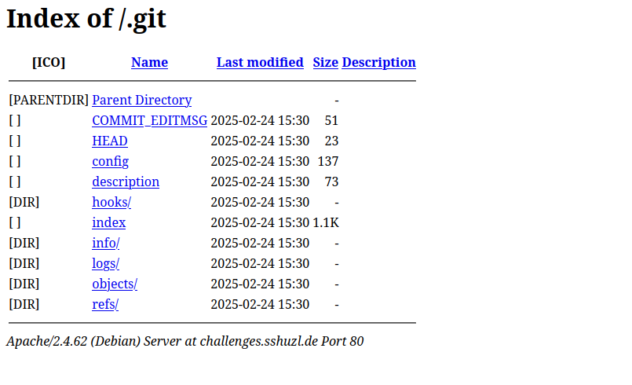

# Writeup git_observer

The challenge website seems to contain nothing obviously interesting. Let's look at the description again.

From the challenge description we learn two things:

> History does not forget and robots can help.

1. Some history might be interesting
2. Something with robots can help

After doing search research on the web with "ctf web robots" we learn about the file `robots.txt`. To learn more about what the
`robots.txt` file is, check out [this article](https://developers.google.com/search/docs/crawling-indexing/robots/create-robots-txt).

Looking at the `robots.txt` under the URL `https://challenges.sshuzl.de/git_observer/robots.txt` we find this:

```robots.txt
# Global rules for all user agents
User-agent: *
Disallow: /admin/
Disallow: /cgi-bin/
Disallow: /config/
Disallow: /logs/
Disallow: /private/
Disallow: /tmp/
Disallow: /backup/
# Hidden directory (internal use)
Disallow: /.git/
```

That seems interesting! The comment tells us that the directory at `./.git/` is "hidden" and only for internal use.
Including the directory in the `robots.txt` does not actually make it hidden. Since the challenge name contains `git` as well,
this seems like a promising directory to look at.

Accessing the directory with our browser at `https://challenges.sshuzl.de/git_observer/.git/` we find:



This looks like a git repository.

After some research we find that we can use the commandline tool `wget` to download such a directory using:

`wget --recursive --no-parent https://challenges.sshuzl.de/git_observer/.git/`

We can then enter the directory and find the `.git` directory, signaling that the directory `git_observer` is a git repository.

As the challenge description suggests, the history is interesting. Now we can use any tool (e.g. `lazygit`) of our choice to view the git history.
We can use plain git with commands like `git log` or `git diff` to see which changes a certain commit introduced.

Using `git log` we can find the commit starting with id `e0a038` with commit message `Hide flag in environment variables`. Checking which changes the
commit introduced, we find the flag:

```git
$ git diff e0a038~ e0a038 # I looked this command by searching for `git view commit changes`

diff --git a/src/app.py b/src/app.py
index 26a16ab..ccf0ca9 100644
--- a/src/app.py
+++ b/src/app.py
@@ -1,3 +1,4 @@
+import os
 from flask import Flask, render_template, request, redirect, url_for, session, flash
 import requests

@@ -120,7 +121,7 @@ def advanced_search():
     if not session.get('is_admin'):
         # Tease the user by saying only admins can perform an advanced search.
         return "Error: Advanced search is available only for admins.", 403
-    secret_flag = "SSH{L057_1N_H1570RY}"
+    secret_flag = os.getenv('SECRET_FLAG', 'THIS_IS_A_FAKE_FLAG')
     return f"Advanced search result: {secret_flag}"

 if __name__ == '__main__':
```

Like this we found the flag :)
